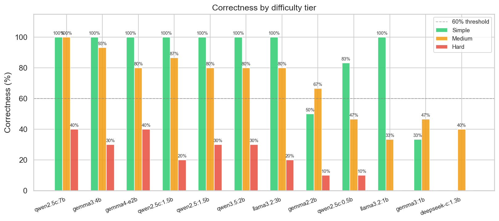
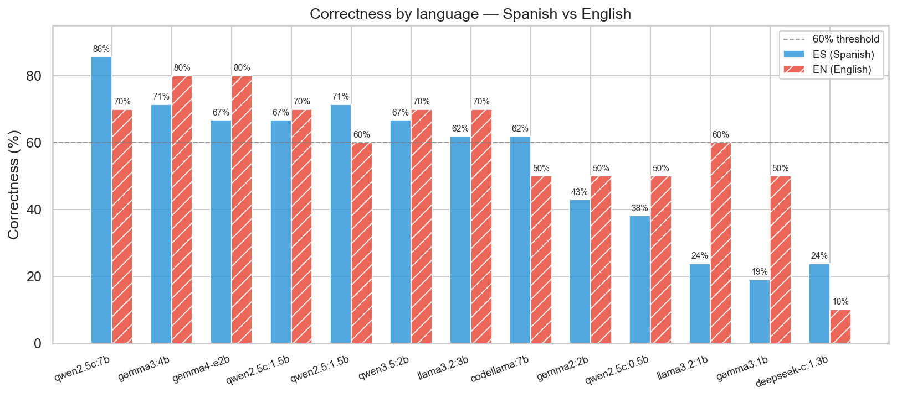
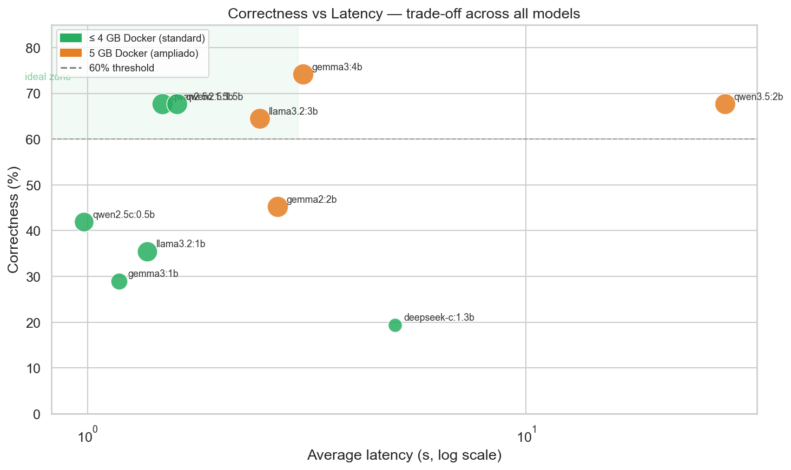

## 1. Executive Summary

Twelve open-source language models executable locally via [Ollama](https://ollama.com) were evaluated for the text-to-SQL component of the system. The evaluation covers three hardware tiers: **standard (Docker 5 GB)**, **advanced (Docker 8 GB+)**, and a **downgrade option (Docker 4 GB)** for constrained machines.

The **default** selected model is **`gemma3:4b`** (100% valid SQL, 74.2% correctness, ~3.1 s latency, ~4.0 GB RAM), targeting machines with Docker 5 GB. For advanced hardware (Docker 8 GB+), the best model is **`qwen2.5-coder:7b`** with 80.6% correctness and 10.5 s latency. The initial evaluation with 5 simple questions showed `qwen2.5:1.5b` at 100% accuracy, but expanding the suite to 31 questions covering subqueries, non-standard dates, and nested aggregations dropped that model to 55% (below the 60% minimum threshold), revealing that `qwen2.5-coder:1.5b` is more robust — and that `gemma3:4b` outperforms both at 5 GB Docker.

---

## 2. System Constraints

The central requirement of the project is that **the system must run entirely locally**, without depending on external APIs or cloud infrastructure. This imposes three concrete constraints on model selection:

| Constraint | Description |
|---|---|
| **No dedicated GPU** | The reference hardware is a consumer laptop. Inference is 100% CPU. |
| **Limited memory** | Docker Desktop with ~5 GB allocated RAM. The model must run within that limit. |
| **Portability** | The system must work with `docker compose up --build` on any machine without additional steps. |

### Reference Hardware

- **Minimum viable:** MacBook Air 2019–2021 Intel, 8 GB RAM, ~256 GB SSD — Docker Desktop ~5 GB
- **Typical:** MacBook Air M1/M2, 8–16 GB RAM — Docker Desktop 5–8 GB
- **Not required:** Dedicated GPU, cloud instance, memory >16 GB

> **Note on the evaluation environment:** Benchmarks were run with a Docker allocation of **2.4 GB** (below standard). Models that failed in this configuration are documented in 6 with their actual memory requirement. On a standard MacBook Air (8 GB / Docker 5 GB), models up to ~3B parameters run without issue.

---

## 3. Evaluation Metrics (KPIs)

Five indicators were defined. The first three are **functional quality** metrics that can be measured automatically; the last two are **resource metrics** that determine viability on the reference hardware.

---

### KPI 1 — Valid SQL rate (`sql_validity_rate`)

**Definition:** Percentage of queries for which the model generates SQL that the SQLite engine executes without error, on the first attempt.

```
sql_validity_rate = (queries without syntax or execution error) / (total queries) × 100
```

**Why it matters:** Invalid SQL forces retries and increases latency. A model with a low valid-SQL rate is unusable in production without costly correction logic.

**Minimum acceptable threshold:** ≥ 80%

---

### KPI 2 — Correct answer rate (`correctness_rate`)

**Definition:** Percentage of queries whose result matches the pre-computed *ground truth* (see 4). Verification is automatic, comparing the returned value, row count, or column name against the expected value.

```
correctness_rate = (answers with correct result) / (total queries) × 100
```

**Why it matters:** SQL that executes without error but returns the wrong result (e.g., ignores the `WHERE week_day = 'Friday'` filter) is equally useless. This KPI captures the model's semantic understanding.

**Minimum acceptable threshold:** ≥ 60%

---

### KPI 3 — Average latency (`avg_latency_s`)

**Definition:** Time in seconds from when the request reaches the model until it returns a complete response (no streaming), averaged over all queries with at least one generated response.

```
avg_latency_s = Σ(time_per_query) / n_queries_responded
```

**Why it matters:** On a laptop without a GPU, inference is CPU-bound. Times >20 s make the interface unusable. The goal is to keep the perceived response time reasonable for the end user.

**Maximum acceptable threshold:** ≤ 15 s on the reference hardware

---

### KPI 4 — Retry rate (`avg_retries`)

**Definition:** Average number of additional attempts (beyond the first) that the model needs to produce executable SQL per query.

```
avg_retries = Σ(retries_per_query) / n_queries
```

**Why it matters:** Each retry doubles the perceived latency. A model that requires 1.5 retries on average triples the actual time. Retries also consume context and degrade the quality of the feedback.

**Maximum acceptable threshold:** ≤ 0.5

---

### KPI 5 — Memory requirement

**Definition:** Approximate RAM needed for Ollama to load the model and run inference, measured empirically or estimated from the Q4_K_M quantized size. Reported alongside the model file size.

**Why it matters:** Directly determines portability. A model that exceeds the Docker Desktop limit on the reference hardware fails the system requirement, regardless of its quality.

| Category | RAM required | Reference hardware |
|---|---|---|
| ✅ Universal | < 2 GB | Works on any machine |
| ✅ Lightweight | 2 – 4 GB | Requires 8 GB RAM / 4 GB Docker |
| ✅ Standard | 4 – 6 GB | Requires 8 GB RAM / 5 GB Docker |
| ❌ Specialized | > 6 GB | Requires GPU or high-performance machine |

---

## 4. Test Suite

**31 reference queries** were designed in two languages on the `data.csv` dataset (~24,212 POS transaction records). The queries cover three difficulty levels and represent real use cases of the system.

### Distribution

| Language / Difficulty | Simple | Medium | Hard | Total |
|---|---|---|---|---|
| Spanish (ES) | 4 | 10 | 7 | **21** |
| English (EN) — semantic duplicates | 2 | 5 | 3 | **10** |
| **Total** | **6** | **15** | **10** | **31** |

The English duplicates share the same `reference_sql` as their Spanish counterpart, allowing direct comparison of model performance by question language.

### Representative examples by difficulty

| Level | Example | SQL pattern |
|---|---|---|
| Simple | How many records are there in total? | `COUNT(*)` |
| Simple | How many distinct waiters are there? | `COUNT(DISTINCT waiter)` |
| Medium | What is the most bought product on Fridays? | `WHERE` + `GROUP BY` + `LIMIT 1` |
| Medium | What are the 5 products with the highest total revenue? | `SUM` + `GROUP BY` + `LIMIT 5` |
| Hard | Which products have a total quantity above the average? | `HAVING` + nested subquery |
| Hard | Which waiter has the highest average revenue per ticket? | Two-level subquery |
| Hard | In which month was the highest total revenue recorded? | `SUBSTR`/`INSTR` on `M/D/YYYY` format |
| Hard | How much did each waiter generate in October 2024? | Date filter with `LIKE` on non-standard format |

### Evaluation framework

Instead of hardcoded expected values, each question carries a `reference_sql` field. At evaluation time:

1. `reference_sql` is executed against the database → reference result.
2. The SQL generated by the model is executed → model result.
3. Both sets are compared with `results_match()`: normalizes numeric values to 4 decimal places, ignores case, sorts values within each row (column-alias-insensitive) and optionally sorts rows (order-insensitive when order is not semantically relevant).

The evaluation script is at `eval/benchmark.py` and can be reproduced with:

```bash
python3 eval/benchmark.py                  # all models
python3 eval/benchmark.py qwen2.5-coder:1.5b  # specific model
```

---

## 5. Evaluated Models

### 5a. Models with full benchmark — downgrade environment (Docker 4 GB)

All run via Ollama with Q4_K_M quantization on CPU.

| Model | Organization | Parameters | File size | Est. RAM | Focus |
|---|---|---|---|---|---|
| `qwen2.5-coder:0.5b` | Alibaba | 0.5 B | 313 MB | ~0.5 GB | Code |
| `qwen2.5-coder:1.5b` | Alibaba | 1.5 B | 986 MB | ~1.2 GB | Code |
| `qwen2.5:1.5b` | Alibaba | 1.5 B | 986 MB | ~1.2 GB | General (instruct) |
| `llama3.2:1b` | Meta | 1.2 B | 1.3 GB | ~1.5 GB | General |
| `deepseek-coder:1.3b` | DeepSeek AI | 1.3 B | 776 MB | ~1.0 GB | Code |

### 5b. Models with full benchmark — standard hardware (Docker 5 GB)

| Model | Organization | Parameters | File size | Est. RAM | Focus |
|---|---|---|---|---|---|
| `llama3.2:3b` | Meta | 3.2 B | 2.0 GB | ~2.0 GB | General |
| `gemma2:2b` | Google | 2.6 B | 1.6 GB | ~2.5 GB | General |
| `gemma3:4b` | Google | 4 B | 3.3 GB | ~4.0 GB | General (requires num_ctx cap) |
| `qwen3.5:2b` | Alibaba | 2 B | 2.7 GB | ~4.0 GB | General (requires num_ctx cap) |

### 5c. Discarded models — not evaluable

| Model | Organization | Parameters | File size | Problem | Notes |
|---|---|---|---|---|---|
| `qwen3.5:4b` | Alibaba | 4 B | 3.4 GB | Extreme latency | >150 s/query even with think=false; indefinite hangs on hard queries |
| `sqlcoder:7b` | Defog AI | 7 B | 4.1 GB | Incompatible prompt‡ | Requires ≥ 6 GB RAM |

> ‡ `sqlcoder:7b` is available on Ollama but requires a specific prompt template (`### Task / ### Database Schema / ### Answer`) different from the standard instruct format used by this system. With the current prompt it generates explanatory text instead of SQL. A dedicated prompt path in the benchmark would be needed to evaluate it correctly.

### 5d. Evaluated models — Docker 8 GB tier

| Model | Organization | Parameters | File size | Est. RAM | Focus |
|---|---|---|---|---|---|
| `qwen2.5-coder:7b` | Alibaba | 7.6 B | 4.7 GB | ~5.5 GB | Code/SQL (fine-tuned) |
| `gemma4:e2b` | Google | ~4 B (quantized) | 3.7 GB | ~7.2 GB | General |

---

## 6. Benchmark Results

Expanded suite of **31 questions** (21 ES + 10 EN) across 3 difficulty levels. Additional metrics: `ES%` (correct in Spanish) and `EN%` (correct in English).

### 6a. Comparative table — all evaluated models

| Model | SQL% | OK% | ES% | EN% | Avg lat | Retries | RAM | Verdict |
|---|---|---|---|---|---|---|---|---|
| **`qwen2.5-coder:7b`**¶ | 96.8% | **80.6%** | **85.7%** | 70.0% | 10.5 s | 0.16 | ~5.5 GB | ⭐ Selected (Docker 8 GB) |
| `gemma3:4b`† | 100% | **74.2%** | **71.4%** | **80.0%** | 3.1 s | 0.00 | ~4.0 GB | ⭐ Selected (Docker 5 GB) — **default** |
| `gemma4:e2b`¶ | 100% | 71.0% | 66.7% | **80.0%** | 15.1 s | 0.00 | ~7.2 GB | 8 GB, strong in English |
| `qwen3.5:2b`† | 96.8% | 67.7% | 66.7% | 70.0% | 28.4 s | 0.13 | ~4.0 GB | Unacceptable latency (think=false) |
| **`qwen2.5-coder:1.5b`** | **100%** | 64.5% | 66.7% | 60.0% | **1.5 s** | **0.10** | ~1.2 GB | ⭐ Selected (Docker 4 GB) |
| `llama3.2:3b` | 100% | 64.5% | 61.9% | 70.0% | 2.4 s | 0.16 | ~2.0 GB | Good (more RAM) |
| `qwen2.5:1.5b` | 100% | 54.8% | 61.9% | 40.0% | 1.6 s | 0.00 | ~1.2 GB | Below threshold |
| `llama3.2:1b` | 96.8% | 41.9% | 33.3% | 60.0% | 1.6 s | 0.29 | ~1.5 GB | Insufficient |
| `gemma2:2b` | 93.5% | 38.7% | 33.3% | 50.0% | 2.8 s | 0.23 | ~2.5 GB | Insufficient |
| `qwen2.5-coder:0.5b` | 93.5% | 32.3% | 23.8% | 50.0% | 0.7 s | 0.19 | ~0.5 GB | Ultra-fast/limited |
| `gemma3:1b` | 61.3% | 32.3% | 28.6% | 40.0% | 1.3 s | 1.32 | ~1.0 GB | Below threshold |
| `deepseek-coder:1.3b` | 0% | 0% | 0% | 0% | — | — | ~1.0 GB | HTTP 500 error‡ |
| `qwen3.5:4b` | N/A | — | — | — | — | — | >5 GB | Extreme latency (>150 s/q)∥ |
| `sqlcoder:7b` | N/A | — | — | — | — | — | ~5 GB | Incompatible prompt§ |

> † `gemma3:4b` and `qwen3.5:2b` require `num_ctx=4096` to fit in Docker 5 GB. Without that cap, Ollama pre-allocates KV cache for 32K–128K token contexts that exceed the limit. With the cap, quality is unaffected: our prompts are ~350 tokens in the worst case.

> ‡ `deepseek-coder:1.3b` passes the availability check but returns HTTP 500 on actual generation — likely deferred OOM or model state corruption under generation load.

> § `sqlcoder:7b` uses a `### Task / ### Database Schema / ### Answer` template incompatible with the system's standard instruct prompt. Manually tested: generates explanatory text instead of SQL with the current prompt.

> ¶ `qwen2.5-coder:7b` and `gemma4:e2b` require Docker 8 GB (≥7 GB RAM available for Ollama). Not suitable for 5 GB Docker hardware.

> ∥ `qwen3.5:4b` produces indefinite hangs on complex queries even with `think=false`. Discarded for latency and instability.

---

### 6b. Per-model analysis

#### `qwen2.5-coder:1.5b` — Empirical winner (standard hardware)

Best model for reference hardware: **100% valid SQL, 64.5% correct, 1.5 s latency**. Outperforms its general instruct variant (`qwen2.5:1.5b`) in the expanded suite, particularly on complex grouping and subqueries. Code specialization is advantageous as queries become harder. Exact tie with `llama3.2:3b` in correctness but at half the RAM, making it superior for reference hardware.

#### `llama3.2:3b` — Alternative for higher-memory hardware

Ties with `qwen2.5-coder:1.5b` on overall correctness (64.5%) but **leads in English (70% vs 60%)**. Requires ~2 GB RAM (vs ~1.2 GB). Recommended for machines with Docker ≥ 4 GB and workloads with predominantly English questions.

#### `qwen2.5:1.5b` — Overtaken by the expanded suite

Winner of the initial evaluation (5 questions, 100%). Expanding to 31 questions with real difficulty dropped it to **54.8%** — below the 60% minimum threshold. Fails especially in English (40%) and on hard queries. General instruct fine-tuning is less robust than code-oriented fine-tuning for complex SQL queries.

#### `llama3.2:1b` and `gemma2:2b` — Insufficient

Both below 60% correctness. `llama3.2:1b` is fast but inaccurate in Spanish (33.3%). `gemma2:2b` shows higher latency than `llama3.2:3b` with worse results.

#### `qwen2.5-coder:0.5b` — Ultra-fast for constrained environments

32.3% correctness — well below threshold. However, its 0.7 s latency and ~0.5 GB consumption make it the only viable option on hardware with less than 1 GB of RAM available for the model.

#### `gemma3:4b` — Best overall model (Docker 5 GB) — **default**

With `num_ctx=4096`, runs within the 5 GB Docker limit and achieves **74.2% correctness** — the best result in the entire evaluation at this memory tier. Particularly strong in English (80%) and on medium queries (86.7%). Latency of 3.1 s and zero retries. Requires Docker ≥ 5 GB; not suitable for <4 GB Docker hardware. This is the recommended default.

#### `qwen3.5:2b` — Discarded for latency

Evaluated in two modes: with thinking (default) and with `think=false` via Ollama options.

| Mode | SQL% | Correct | ES% | EN% | Latency |
|---|---|---|---|---|---|
| `think=true` (default) | 100% | 64.5% | 71.4% | 50.0% | 32.0 s |
| `think=false` | 96.8% | 67.7% | 66.7% | 70.0% | 28.4 s |

Disabling thinking slightly improves correctness (+3.2 pp) and latency (−3.6 s), but **28.4 s remains unacceptable** for an interactive interface. The slowness does not come from internal reasoning but from CPU inference of the model itself — the Qwen3.5 architecture is slower than Gemma3 at equivalent size on this hardware.

#### `qwen2.5-coder:7b` — Best overall model (Docker 8 GB)

With 7.6 B parameters and code-oriented fine-tuning, `qwen2.5-coder:7b` achieves **80.6% correctness** — the best result in the entire evaluation. Particularly strong in Spanish (85.7%), being the only model that exceeds 80% overall correctness. Achieved 100% on simple and medium questions; failures are concentrated on non-standard date format queries (Q18, Q18b) and two-level subqueries (Q15). Average latency of 10.5 s, with peaks of 30–45 s on complex queries. Requires Docker 8 GB (~5.5 GB RAM). Recommended for users with extended hardware.

#### `gemma4:e2b` — Second option (Docker 8 GB)

`gemma4:e2b` achieves **71.0% correctness** with 100% valid SQL and zero retries — robust at generating syntactically correct SQL. Strong in English (80%) and impressive on medium queries (80%), but fails on hard queries involving non-standard date formats (Q18, Q19) and per-waiter averages (Q17). Its average latency of 15.1 s is the highest of all evaluated models, its main disadvantage against `qwen2.5-coder:7b`.

#### `gemma3:1b` — Discarded

61% valid SQL (below the 80% threshold) and 32% correctness, with 1.32 average retries. The high retry rate indicates the model frequently generates SQL with syntax or structural errors. Being the only Gemma3 model runnable on reference hardware, it offers no advantage over equivalent models from the Qwen2.5 family.

#### `deepseek-coder:1.3b` — Discarded

0% valid SQL — HTTP 500 on all queries. Behavior consistent with deferred OOM or model state corruption under generation load.

---

### 6c. Performance by difficulty level

| Model | Simple (6q) | Medium (15q) | Hard (10q) |
|---|---|---|---|
| `qwen2.5-coder:7b`¶ | **100%** | **100%** | **50.0%** |
| `gemma3:4b`† | **100%** | **86.7%** | 30.0% |
| `gemma4:e2b`¶ | 100% | 80.0% | 40.0% |
| `qwen2.5-coder:1.5b` | 100% | 86.7% | 20.0% |
| `llama3.2:3b` | 100% | 80.0% | 20.0% |
| `qwen3.5:2b`† | 100% | 73.3% | 20.0% |
| `qwen2.5:1.5b` | 83.3% | 73.3% | 10.0% |
| `llama3.2:1b` | 83.3% | 46.7% | 10.0% |
| `gemma2:2b` | 66.7% | 53.3% | 0.0% |
| `qwen2.5-coder:0.5b` | 83.3% | 33.3% | 0.0% |
| `gemma3:1b` | 66.7% | 26.7% | 0.0% |

Hard questions (subqueries, non-standard dates, two-level aggregations) expose a clear gap. `qwen2.5-coder:7b` is the only model that exceeds 40% at that level (50%), thanks to its code-specific fine-tuning. Models with 1–4B parameters stay in the 20–40% range.



**Correctness by language** — `gemma3:4b` leads in English (80%); most models perform better in Spanish:



> Charts are generated with `python3 eval/charts.py` (requires `pip install -r eval/requirements.txt`).

---

## 7. Trade-off Analysis

### Speed vs. accuracy (expanded suite, 31 questions)

The following chart summarizes the central trade-off: X axis = average latency (log scale), Y axis = correctness. Green = standard hardware (Docker 5 GB); orange = downgrade (4 GB); purple = advanced (8 GB). Each bubble size is proportional to the valid SQL rate.



`qwen2.5-coder:7b` leads in the top corner at 80.6% correctness at 10.5 s. `gemma3:4b` occupies the ideal balance zone (74.2%, 3.1 s) but requires Docker 5 GB. `qwen2.5-coder:1.5b` dominates the sub-2 s band for standard hardware. `qwen3.5:2b` and `gemma4:e2b` are pushed to the right by high latency.

The correlation between size and accuracy is confirmed in the expanded suite, but with nuance: `qwen2.5:1.5b` (general instruct) is outperformed by `qwen2.5-coder:1.5b` (code-oriented) on complex queries — SQL fine-tuning makes a difference from Q15 onward.

### Portability vs. quality

| Scenario | Recommended model | Correctness | RAM |
|---|---|---|---|
| Minimum (Docker < 2 GB) | `qwen2.5-coder:0.5b` | 32% | ~0.5 GB |
| Downgrade (Docker 4 GB) | **`qwen2.5-coder:1.5b`** | **64.5%** | ~1.2 GB |
| Standard (Docker 5 GB) | **`gemma3:4b`** | **74.2%** (EN 80%) | ~4.0 GB |
| Advanced (Docker 8 GB) | **`qwen2.5-coder:7b`** | **80.6%** (ES 85.7%) | ~5.5 GB |

### Why not a larger model?

`sqlcoder:7b` (the only 7B SQL-specialized model available on Ollama) has a prompt format incompatible with the current system. Models with 13B+ parameters on CPU require >60 s per query — unacceptable for an interactive interface.

`qwen2.5-coder:7b` is the practical limit for CPU inference: 10.5 s average latency at 80.6% correctness. For 5 GB Docker hardware, the sweet spot remains `gemma3:4b`; the 8 GB tier is an option for machines with more resources.

---

## 8. Selected Models

### SQL model: `gemma3:4b` (Docker 5 GB) — default

| Criterion | Value | Meets threshold |
|---|---|---|
| Valid SQL rate | 100% | ✅ (≥ 80%) |
| Correct answer rate | 74.2% | ✅ (≥ 60%) |
| Average latency | 3.1 s | ✅ (≤ 15 s) |
| Average retries | 0.00 | ✅ (≤ 0.5) |
| Required RAM | ~4.0 GB | ✅ Docker 5 GB |

`gemma3:4b` is the best model by correctness that runs within a reasonable memory limit (Docker 5 GB). Requires `num_ctx=4096` to fit within that limit (already configured in the code).

### NL model: `qwen2.5-coder:1.5b`

The natural-language answer model stays at `qwen2.5-coder:1.5b`: it is fast (1.5 s), already downloaded as the SQL model fallback, and the task of paraphrasing a tabular result is less demanding than generating correct SQL. Using the same 4B model for both tasks would consume ~8 GB additional RAM with no appreciable gain in prose answer quality.

### Why not `qwen2.5-coder:7b` as SQL model

`qwen2.5-coder:7b` achieves 80.6% correctness (+6.4 pp over `gemma3:4b`) but its latency of **10.5 s average** is 3.4× higher than `gemma3:4b` (3.1 s). It also requires Docker 8 GB (~5.5 GB RAM), raising the hardware requirement without the accuracy gain justifying it for the interactive use case. The 6 pp improvement does not compensate tripling the latency and doubling the memory requirement.

### Why not `qwen2.5-coder:1.5b` as SQL model (previous model)

In the initial evaluation (5 simple/medium questions), `qwen2.5-coder:1.5b` scored 100% and was the best within 5 GB Docker. With the suite expanded to 31 questions, `gemma3:4b` outperforms it by 9.7 pp (74.2% vs 64.5%) at comparable latency (3.1 s vs 1.5 s) and zero retries. The trade-off of requiring Docker 5 GB in exchange for nearly 10 pp of correctness is favorable.

### Why not `qwen2.5:1.5b` (original model)

In the initial evaluation (5 simple/medium questions), `qwen2.5:1.5b` scored 100% accuracy and was selected. Expanding the suite to 31 questions with real difficulty dropped it to **54.8%** — below the 60% minimum threshold. Fails especially in English (40%) and on queries with subqueries or complex groupings. The earlier hypothesis ("code fine-tuning reduces flexibility") reverses with more demanding queries: code-oriented fine-tuning is an advantage, not a limitation.

### Mitigation strategies for model limitations

The following strategies are implemented to maximize reliability:

1. **Full schema injection** in every system prompt — the model does not need to "remember" the table structure.
2. **Few-shot examples** with 3 question→SQL pairs in the prompt to anchor the output format.
3. **Correction loop with feedback** — if SQL fails, the SQLite error is included in the next attempt's prompt (up to 3 retries).
4. **Output cleanup** — code strips markdown fences, explanatory text, and residual punctuation before executing the SQL.

---

## 9. Models Considered But Not Evaluated

The following models were investigated during the selection process but **could not be evaluated with complete metrics** due to hardware constraints or not being executable locally on the reference hardware.

### 9a. Require hardware above reference

These models are open-source and executable locally via Ollama, but their memory requirement excludes them from the reference hardware (MacBook Air 8 GB / Docker 5 GB).

| Model | Parameters | Est. RAM | Reason for exclusion |
|---|---|---|---|
| `llama3.2:3b` | 3.2 B | ~3.0 GB | Requires ≥8 GB RAM / 4 GB Docker. OOM in restricted environment. |
| `gemma2:2b` (Google) | 2.6 B | ~2.5 GB | Borderline on standard reference. OOM in restricted environment. |
| `codellama:7b` (Meta) | 7 B | ~5.0 GB | Same memory problem as qwen2.5-coder:7b. |
| `mistral:7b` (Mistral AI) | 7 B | ~5.0 GB | General purpose; requires 16 GB RAM. |
| `starcoder2:3b` (BigCode) | 3 B | ~2.5 GB | Code-specialized; requires ≥4 GB Docker. |
| `phi3:mini` (Microsoft) | 3.8 B | ~2.8 GB | Requires ≥4 GB Docker for stable inference. |
| `phi3.5:mini` (Microsoft) | 3.8 B | ~2.8 GB | Same constraint as phi3:mini. |

### 9b. Available only as API (not locally executable)

These models offer superior quality but **violate the fundamental requirement** of the project: they must run entirely on the user's machine without connecting to external services.

| Model | Provider | Reason for exclusion |
|---|---|---|
| GPT-4o / GPT-4-turbo | OpenAI | Proprietary API. Requires connection and paid key. |
| GPT-3.5-turbo | OpenAI | Proprietary API. Per-token costs. |
| Claude 3.5 Sonnet / Haiku | Anthropic | Proprietary API. Requires API key. |
| Gemini Pro / Flash | Google | Proprietary API. Requires account and key. |
| Gemini 2.0 Flash | Google | Same problem as Gemini Pro. |
| Mixtral 8x7B (API) | Mistral AI | Available as API; local version requires ~90 GB RAM. |

> Assignment note: including an API as an extra comparison feature is allowed, but the locally-hosted model must be the primary case.

### 9c. Available only via HuggingFace (no native Ollama support)

These models require a custom inference pipeline with `transformers` + `torch`, which adds complexity to the Dockerfile (heavy base image with CUDA/CPU) and is incompatible with the system architecture.

| Model | Organization | Parameters | Note |
|---|---|---|---|
| `defog/sqlcoder-7b-2` | Defog AI | 7 B | SQL-specialized, excellent quality. Requires GPU (14 GB VRAM) or very slow CPU inference. Ollama equivalent: `sqlcoder:7b` (see 5c). |
| `defog/sqlcoder-34b` | Defog AI | 34 B | Maximum SQL quality. Impractical on consumer hardware. |
| `NumbersStation/nsql-350M` | NumbersStation | 350 M | Small and fast, but requires HuggingFace + transformers. No Ollama support. |
| `NumbersStation/nsql-6B` | NumbersStation | 6 B | Same infrastructure constraint + requires GPU. |
| `mrm8488/t5-base-finetuned-wikiSQL` | HuggingFace community | 250 M | Very small. Only fine-tuned on WikiSQL, does not generalize well to arbitrary schemas. |
| `cssupport/t5-small-awesome-text-to-sql` | HuggingFace community | 60 M | Ultra small. Very low quality on queries outside WikiSQL. |
| `tscholak/3vnuv1vf` (Picard) | Salesforce | 3 B | Interesting constrained decoding system, but requires its own infrastructure. |
| `starcoder2-15b` | BigCode | 15 B | Code-oriented, no SQL-specific fine-tuning. Requires GPU. |

---

## 10. Framework Research: LangChain / LangGraph

During development, the possibility of replacing the LLM integration layer using **LangChain** and its `create_sql_agent` component was evaluated, instead of direct calls to the Ollama REST API.

### What LangChain offers for this use case

LangChain provides:

- **`ChatOllama` / `OllamaLLM`**: abstraction over HTTP calls to Ollama, replacing `ollama_client.py`.
- **`SQLDatabaseChain`** (deprecated in v0.2) / **`create_sql_agent`**: pre-built pipeline that injects the schema, generates SQL, executes it, and produces a natural-language response — equivalent to `text_to_sql.py` + `nl_response.py` in a single object.
- **`ChatPromptTemplate`**: structured prompt management instead of f-strings.
- **LangSmith**: integrated traceability and observability, useful for debugging prompt quality.

`create_sql_agent` goes beyond a fixed pipeline: it hands the LLM a set of **tools** (`sql_db_list_tables`, `sql_db_schema`, `sql_db_query`, `sql_db_query_checker`) and lets it decide which to use at each step. This enables multi-step reasoning — for example, querying column names first, then formulating the query — and self-correction by re-reading the schema on errors.

### Why it was decided not to use it

| Reason | Detail |
|---|---|
| **Dependency overhead** | LangChain adds ~40 transitive dependencies. The current `requirements.txt` has 5 packages. The Docker image size would increase considerably. |
| **API instability** | LangChain has had 2–3 major restructurings in 2 years (v0.1 → v0.2 → v0.3). `SQLDatabaseChain` was deprecated and replaced by `create_sql_agent` in short cycles. This introduces future breakage risk. |
| **Extra latency from agent** | `create_sql_agent` makes multiple LLM calls per question (table discovery, schema reading, SQL generation, verification). On a 1.5B model with ~2.5 s per call, a simple question can take 10–15 s instead of 2.5 s. |
| **Unnecessary complexity** | The current flow is linear: `question → SQL → execute → NL answer`. The retry loop is ~20 lines. There is no complex branching that would justify a state graph. |
| **No observable functional benefit** | For a single table with straightforward analytical queries, the agent provides no additional capability over the manual pipeline with few-shot prompting. |

### When it would be a valid option

LangChain / LangGraph becomes a reasonable choice if the system evolves toward:

- **Multiple tables with complex JOINs**: the agent can explore the schema dynamically instead of injecting it fully into the prompt.
- **Multi-step reasoning**: questions that require intermediate queries (e.g., "The best-selling product in the highest-revenue month?").
- **Flows with human approval**: LangGraph allows pausing the graph and waiting for confirmation before executing destructive queries.
- **Production observability**: LangSmith offers detailed traces of each pipeline step, useful for detecting regressions in model quality.
- **Multiple heterogeneous tools**: if the system needs to combine SQL with vector search, external APIs, or documents, LangChain's tool abstraction is valuable.

In the current state of the project, the cost exceeds the benefit. The direct implementation is lighter, more predictable, and easier to maintain.

---

## 11. Alternative Considered: Direct Inference with HuggingFace Transformers

The possibility of replacing Ollama with direct inference using the HuggingFace `transformers` library inside the application container was evaluated.

### What this approach would offer

- **Single container**: eliminates the `ollama` service from docker-compose; the model is loaded in the same Python process as FastAPI.
- **Access to HuggingFace-exclusive models**: SQL-specialized models like `NumbersStation/nsql-350M` are not available on Ollama and can only be used via `transformers`.
- **Fine-grained control over the inference pipeline**: direct access to logits, embeddings, sampling parameters, custom tokenization.

### Why it was discarded

| Reason | Detail |
|---|---|
| **Docker image +2–3 GB** | `torch` (CPU) weighs ~2.5 GB in dependencies alone. The current image is ~400 MB total. |
| **Slower CPU inference** | Ollama uses llama.cpp internally, which is highly optimized for CPU via GGUF and BLAS routines. PyTorch on CPU is considerably slower for transformer inference. |
| **Manual quantization management** | Ollama applies Q4_K_M automatically. With `transformers`, `bitsandbytes` is needed for 4-bit/8-bit quantization, or a separate GGUF loader (`llama-cpp-python`), adding Dockerfile complexity. |
| **Risk of total crash** | If the model OOMs inside the FastAPI process, the entire application goes down. With Ollama in a separate container, an OOM only affects the model service; the app can respond with a controlled error. |
| **More complex model cache** | Ollama manages the cache with a Docker volume (`ollama_data`). With `transformers`, the HuggingFace cache directory (`~/.cache/huggingface`) must be managed via a separate volume to avoid re-downloads on every `docker compose up`. |

### When it would be a valid option

- If a model available only on HuggingFace is needed (e.g., `NumbersStation/nsql-350M`) with no Ollama equivalent.
- If fine-tuning or access to internal model representations is required (per-layer embeddings, logits, attention).
- If the deployment environment already has `torch` installed for other reasons, absorbing the cost of the dependency.

---

## 12. Alternative Considered: GPU Acceleration on Apple Silicon (Metal / MPS)

Whether it was possible to leverage the GPU cores and Neural Engine of Apple Silicon chips (M1/M2/M3/M4) present on the reference hardware (MacBook Air) was investigated.

### The problem with Docker on Mac

Docker on macOS runs inside a Linux VM (using Apple's virtualization framework). **Metal** (Apple's GPU API), **MPS** (PyTorch's Metal backend), and the **Neural Engine** are macOS-exclusive APIs and are not accessible from the Linux VM. Consequently, any Docker-based solution — whether Ollama, `transformers`, or `llama-cpp-python` — runs in CPU-only mode regardless of the underlying hardware.

### Options that do work (outside the scope of this project)

| Approach | Acceleration | Requirement |
|---|---|---|
| **Native Ollama on the host** + app in Docker pointing to `host.docker.internal:11434` | ✅ Metal auto-detected | `ollama serve` running on the host Mac |
| **MLX** (`mlx-lm`, `-mlx-bf16` models) | ✅ GPU + unified memory | Native macOS execution, no Docker |
| **PyTorch MPS** (`torch.device("mps")`) | ✅ GPU cores | Native macOS execution, no Docker |

The simplest option for a user who wants higher speed would be to run Ollama natively and change an environment variable: `OLLAMA_BASE_URL=http://host.docker.internal:11434`. This would give a ~3–5× latency improvement on M-series chips without changing a single line of application code.

### Why it was not implemented

The project requirement is that **everything runs inside Docker** with a single `docker compose up --build`. An architecture that requires manual steps outside Docker (installing native Ollama, starting `ollama serve`) violates that portability requirement. It is documented as an optimization option for advanced users, not as the default configuration.

> **Note on MLX:** Ollama provides MLX variants of some models (e.g., `gemma4:e2b-mlx-bf16`). However, these variants also require native macOS execution and do not work inside a Linux container.

---

## 13. Reproducibility

To reproduce this benchmark on any environment with Ollama running:

```bash
# Install dependencies
pip3 install requests

# Run full benchmark
python3 eval/benchmark.py

# Run a specific model
python3 eval/benchmark.py qwen2.5:1.5b

# View results
cat eval/results.json
```

Results are automatically saved to `eval/results.json`.

---

*Document generated as part of the model selection and framework research process for the Nivii practical assignment — May 2026.*
